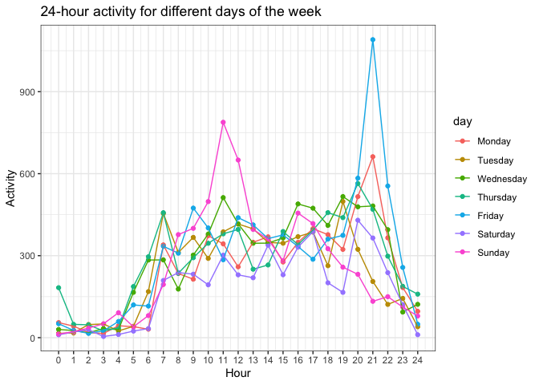

Homework 3
================
Nikhita Damaraju

This is my solution to Homework 3.

Library imports \#\#\#HIDE OUTPUT HERE\#\#\#

``` r
library(p8105.datasets)
library(ggplot2)
library(tidyverse)
library(patchwork)
library(hexbin)
```

# Problem 1

``` r
data("instacart")
```

This dataset contains 1384617 rows and 15 columns. Observations are the
level of items in orders by the user. There are user / order variables –
user ID, order ID, order day, and order hour. There are also item
variables – name, aisle, department, and some numeric codes. Products
are in aisles and aisles are in departments. Each aisle consists of a
vast set of products that are labelled by ‘product\_name’. There are 134
aisles in total.

## Number of aisles and the ones most items are from

``` r
instacart %>%
  count(aisle) %>%
  arrange(desc(n))
```

    ## # A tibble: 134 x 2
    ##    aisle                              n
    ##    <chr>                          <int>
    ##  1 fresh vegetables              150609
    ##  2 fresh fruits                  150473
    ##  3 packaged vegetables fruits     78493
    ##  4 yogurt                         55240
    ##  5 packaged cheese                41699
    ##  6 water seltzer sparkling water  36617
    ##  7 milk                           32644
    ##  8 chips pretzels                 31269
    ##  9 soy lactosefree                26240
    ## 10 bread                          23635
    ## # … with 124 more rows

The items with the maximum counts belong to fresh vegetables, fresh
fruits and packaged vegetables fruits aisles.

## Plot of number of items ordered in each aisles with more than 10k items

``` r
instacart %>%
  count(aisle) %>%
  filter(n > 10000) %>%
  mutate(
    aisle = factor(aisle),
    aisle = fct_reorder(aisle, n)
  ) %>%
  ggplot(aes(x = aisle, y = n)) +
  geom_point() +
  theme(axis.text.x = element_text(angle = 90, vjust = 0.5, hjust = 1)) +
  labs(
    title = "Number of items ordered in each aisle",
    x = "Aisle",
    y = "Number of items"
  )
```

<!-- -->

## Table showing most popular items

``` r
instacart %>%
  filter(aisle %in% c("baking ingredients", "dog food care", "packaged vegetables fruits")) %>%
  group_by(aisle) %>%
  count(product_name) %>%
  mutate(rank = min_rank(desc(n))) %>%
  filter(rank < 4) %>%
  arrange(aisle, rank) %>%
  knitr::kable()
```

| aisle                      | product\_name                                 |    n | rank |
| :------------------------- | :-------------------------------------------- | ---: | ---: |
| baking ingredients         | Light Brown Sugar                             |  499 |    1 |
| baking ingredients         | Pure Baking Soda                              |  387 |    2 |
| baking ingredients         | Cane Sugar                                    |  336 |    3 |
| dog food care              | Snack Sticks Chicken & Rice Recipe Dog Treats |   30 |    1 |
| dog food care              | Organix Chicken & Brown Rice Recipe           |   28 |    2 |
| dog food care              | Small Dog Biscuits                            |   26 |    3 |
| packaged vegetables fruits | Organic Baby Spinach                          | 9784 |    1 |
| packaged vegetables fruits | Organic Raspberries                           | 5546 |    2 |
| packaged vegetables fruits | Organic Blueberries                           | 4966 |    3 |

## Table showing mean hour of the day

``` r
instacart %>%
  filter(product_name %in% c("Pink Lady Apples", "Coffee Ice Cream")) %>%
  group_by(product_name, order_dow) %>%
  summarize(mean_hour = mean(order_hour_of_day)) %>%
  pivot_wider(
    names_from = order_dow,
    values_from = mean_hour
  ) %>%
  knitr::kable()
```

    ## `summarise()` regrouping output by 'product_name' (override with `.groups` argument)

| product\_name    |        0 |        1 |        2 |        3 |        4 |        5 |        6 |
| :--------------- | -------: | -------: | -------: | -------: | -------: | -------: | -------: |
| Coffee Ice Cream | 13.77419 | 14.31579 | 15.38095 | 15.31818 | 15.21739 | 12.26316 | 13.83333 |
| Pink Lady Apples | 13.44118 | 11.36000 | 11.70213 | 14.25000 | 11.55172 | 12.78431 | 11.93750 |

The above table shows the top 3 items in each of the aisles mentioned in
the problem. This gives an idea of what product in each aisle is
purchased the most along with the number of times it has been purchased.

# Problem 2

## Load, tidy and wrangle dataset

``` r
accel_df = 
  read_csv('./hw3_datasets/accel_data.csv') %>%
  janitor::clean_names() %>%
  pivot_longer(
    activity_1:activity_1440,
    names_to = "minute",
    names_prefix = "activity_",
    values_to = "activity"
  ) %>%
  mutate(day_type = ifelse(day %in% c("Saturday", "Sunday"),"weekend", "weekday"),
         minute = as.integer(minute))
```

    ## Parsed with column specification:
    ## cols(
    ##   .default = col_double(),
    ##   day = col_character()
    ## )

    ## See spec(...) for full column specifications.

There are 50400 rows and 6 columns in the accelometer dataset. Columns
include week number, day\_id, day, minute of the day, activity levels
recorded in each minute of the day and day\_type that has been added to
distinguish weekends from weekdays.

## Average activity over the day

``` r
accel_df %>%
  mutate(
    day = forcats::fct_relevel(day, c("Monday","Tuesday","Wednesday","Thursday","Friday","Saturday","Sunday"))
  ) %>%
  group_by(week, day) %>%
  summarize(
    total_activity = mean(activity)
  ) %>%
  pivot_wider(
    names_from = day,
    values_from = total_activity
  ) %>%
  knitr::kable()
```

    ## `summarise()` regrouping output by 'week' (override with `.groups` argument)

| week |    Monday |  Tuesday | Wednesday | Thursday |   Friday | Saturday |    Sunday |
| ---: | --------: | -------: | --------: | -------: | -------: | -------: | --------: |
|    1 |  54.74171 | 213.2599 |  236.1910 | 247.1692 | 333.7102 | 261.2875 | 438.26736 |
|    2 | 205.16042 | 293.9201 |  306.2236 | 329.2000 | 395.0271 | 421.6493 | 293.06806 |
|    3 | 476.32639 | 264.9354 |  325.6035 | 257.7986 | 324.5972 | 265.9222 | 324.34167 |
|    4 | 284.34028 | 221.9222 |  301.7083 | 236.3132 | 106.9785 |   1.0000 | 180.98403 |
|    5 | 270.19444 | 255.4333 |  309.2819 | 381.7069 | 431.1528 |   1.0000 |  96.12569 |

## 24-hour activity time course over a day

``` r
accel_df %>%
  group_by(day_id, minute) %>%
  summarize(
    hourly_activity = mean(activity)
  ) %>%
  ggplot(aes(x = minute, y = hourly_activity, color = day_id)) +
  geom_point() +
  geom_line() +
  theme_bw() +
  labs(
    title = "24-hour activity for different days",
    x = "Minutes of the day",
    y = "Activity"
  )
```

    ## `summarise()` regrouping output by 'day_id' (override with `.groups` argument)

<!-- -->

It can be seen that there is an increase in activity in the first 500
minutes of the day for a few days. However, majority of the acitivity
appears to increase in the last 250 minutes of a day.

## Supplementary plot: 24-hour activity time course over a week

``` r
accel_df %>%
  mutate(
    day = forcats::fct_relevel(day, c("Monday","Tuesday","Wednesday","Thursday","Friday","Saturday","Sunday")),
    hour = round(minute/60)
  ) %>%
  group_by(day, hour) %>%
  summarize(
    hourly_activity = mean(activity)
  ) %>%
  ggplot(aes(x = hour, y = hourly_activity, color = day)) +
  geom_point() +
  geom_line() +
  scale_x_continuous(
    breaks = c(0:24)
  ) +
  theme_bw() +
  labs(
    title = "24-hour activity for different days of the week",
    x = "Hour",
    y = "Activity"
  )
```

    ## `summarise()` regrouping output by 'day' (override with `.groups` argument)

<!-- -->

In this supplementary plot, it can ve seen that on an average, Fridays
have maximum activity in the last few hours in a day. The two largest
peaks belong to Sundays between 9 to 13 hours and Fridays between 20-23
hours. It is also interesting to observe that on an average, weekends
have lesser activity than weekdays.

# Problem 3

``` r
data("ny_noaa")
```

## Data cleaning

``` r
ny_noaa =
  ny_noaa %>%
  separate(date, into = c("year", "month", "day"), sep = "-" ,convert = TRUE) 
ny_noaa = 
  ny_noaa %>% 
  mutate(
    tmin = as.integer(tmin),
    tmax = as.integer(tmax),
    tmin = tmin/10,
    tmax = tmax/10,
    prcp = prcp/10
  )

# Most common snowfall counts in a year
ny_noaa %>%
  count(snow) %>%
  arrange(desc(n))
```

    ## # A tibble: 282 x 2
    ##     snow       n
    ##    <int>   <int>
    ##  1     0 2008508
    ##  2    NA  381221
    ##  3    25   31022
    ##  4    13   23095
    ##  5    51   18274
    ##  6    76   10173
    ##  7     8    9962
    ##  8     5    9748
    ##  9    38    9197
    ## 10     3    8790
    ## # … with 272 more rows

The dataset from the *rnoaa package* consists of 2595176 rows and 9
columns. List of columns include station id, year, month, day, record of
precipitation, snowfall, snow depth, maximum and minimum temperatures
(in C). The dataset has been cleaned to include measurements of
temperature and precipitation in the correct units.

The most common observed values for snowfall in descending order are: \*
0: this could be possible as it does not snow for majority of the yeat
\* NA: this is due to lack of record at certain times of the year \* 25
mm

## Two panel plots between Jan and July showing Avg max temp in each month across years.

``` r
#Since plotting steps do not require NA values, the following step removes all NA values in the dataset
clean_df = 
  ny_noaa %>% drop_na()

jan = 
  clean_df %>%
  group_by(id, year, month) %>%
  summarize(mean_tmax = mean(tmax)) %>%
  filter(month == 1) %>%
  ggplot(aes(x = year, y = mean_tmax, group = id)) +
  geom_point() + geom_path() +
  labs(
    title = "Average max tempertaures for January",
    x = "Year",
    y = "Average max temperature (C)"
  )
```

    ## `summarise()` regrouping output by 'id', 'year' (override with `.groups` argument)

``` r
july = 
  clean_df %>%
  group_by(id, year, month) %>%
  summarize(mean_tmax = mean(tmax)) %>%
  filter(month == 7) %>%
  ggplot(aes(x = year, y = mean_tmax, group = id)) +
  geom_point() + geom_path() +
  labs(
    title = "Average max tempertaures for July",
    x = "Year",
    y = "Average max temperature (C)"
  )
```

    ## `summarise()` regrouping output by 'id', 'year' (override with `.groups` argument)

``` r
jan + july
```

<!-- -->

While the average temperatures across years semmes constant in the month
of July, the average maximum temperatures appear to have a slight
increase in the month of January. This could be due to the effect of
global warming leading to warmer winters.

## 2-panel plots

``` r
temp_plot = 
  ggplot(clean_df, aes(x = tmin, y = tmax)) + 
  geom_hex() +
  labs(
    title = "Temperature plot",
    x = "Minimum daily temperature (C)",
    y = "Maxiumum daily temperature (C)"
  )

snow_plot = 
  clean_df %>%
  filter(snow > 0 & snow < 100) %>%
  ggplot(aes(x = year, y = snow, group = year)) + 
  geom_boxplot() +
  labs(
    title = "Snowfall plot",
    x = "Year",
    y = "Snowfall (mm)"
  )

temp_plot + snow_plot
```

<!-- -->

Temperature hex plot between t\_max and t\_min shows that majority of
the records exist in the boundary of the plot with very less density in
the middle region. This is possibly due to the expected pattern of
temperature change that occurs during a day.

On analyzing the snowfall plot, it can be observed that the average
snowfall across the years appears to be constant. However, the data
recorded seems inconsistent due to the existence of some outliers.
